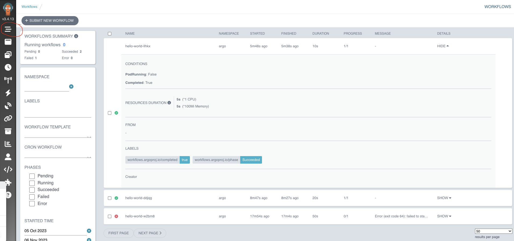
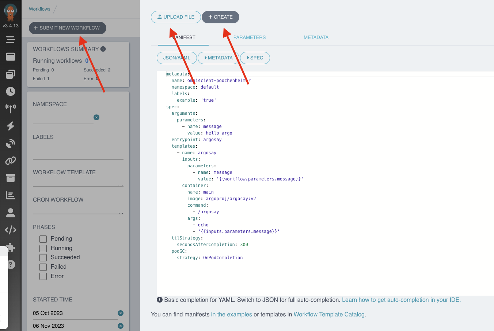

# Basics

Make sure that you are in the argo namespace before starting this tutorial.

## Start the Hello World Example

To start the hello world workflow, try this :

```shell
argo submit hello-world.yaml
```

```log
Name:                hello-world-w2bm8
Namespace:           argo
ServiceAccount:      unset (will run with the default ServiceAccount)
Status:              Pending
Created:             Sun Nov 05 18:56:54 +0100 (now)
Progress:
```

To list the workflows, use this :

```shell
argo list -n argo
```

```log
NAME                STATUS    AGE   DURATION   PRIORITY   MESSAGE
hello-world-w2bm8   Running   50s   50s        0

NAME                STATUS   AGE   DURATION   PRIORITY   MESSAGE
hello-world-w2bm8   Failed   1m    50s        0          Error (exit code 64): failed to start command: fork/exec /usr/local/bin/cowsay: exec format error
```

Using the argo get command, you can always review details of a Workflow run. 

```shell
argo get @latest
```

```log
Name:                hello-world-w2bm8
Namespace:           argo
ServiceAccount:      unset (will run with the default ServiceAccount)
Status:              Failed
Message:             Error (exit code 64): failed to start command: fork/exec /usr/local/bin/cowsay: exec format error
Conditions:
 PodRunning          False
 Completed           True
Created:             Sun Nov 05 18:56:54 +0100 (2 minutes ago)
Started:             Sun Nov 05 18:56:54 +0100 (2 minutes ago)
Finished:            Sun Nov 05 18:57:44 +0100 (1 minute ago)
Duration:            50 seconds
Progress:            0/1
ResourcesDuration:   27s*(1 cpu),27s*(100Mi memory)

STEP                  TEMPLATE  PODNAME            DURATION  MESSAGE
 ✖ hello-world-w2bm8  whalesay  hello-world-w2bm8  40s       Error (exit code 64): failed to start command: fork/exec /usr/local/bin/cowsay: exec format error
```

To get the logs of the last runned workflow :

```shell
argo logs @latest
```

```log
hello-world-w2bm8: time="2023-11-05T17:57:34.457Z" level=info msg="sub-process exited" argo=true error="<nil>"
hello-world-w2bm8: Error: failed to start command: fork/exec /usr/local/bin/cowsay: exec format error
hello-world-w2bm8: failed to start command: fork/exec /usr/local/bin/cowsay: exec format error
```

Well, there is an issue with the architecture of the docker image as it is amd64 but i'm using macos os and it needs arm64.
I will switch to use the busybox image.

## Start the Hello World Busybox Example

Use --watch to follow the workflow execution.

```shell
argo submit --watch hello-world-macos.yaml
```

```log
STEP                  TEMPLATE  PODNAME            DURATION  MESSAGE
 ◷ hello-world-llhkx  whalesay  hello-world-llhkx  9s
Name:                hello-world-llhkx
Namespace:           argo
ServiceAccount:      unset (will run with the default ServiceAccount)
Status:              Running
Created:             Sun Nov 05 19:09:00 +0100 (10 seconds ago)
Started:             Sun Nov 05 19:09:00 +0100 (10 seconds ago)
Duration:            10 seconds
Progress:            0/1

STEP                  TEMPLATE  PODNAME            DURATION  MESSAGE
 ◷ hello-world-llhkx  whalesay  hello-world-llhkx  10s
Name:                hello-world-llhkx
Namespace:           argo
ServiceAccount:      unset (will run with the default ServiceAccount)
Status:              Succeeded
Conditions:
 PodRunning          False
 Completed           True
Created:             Sun Nov 05 19:09:00 +0100 (10 seconds ago)
Started:             Sun Nov 05 19:09:00 +0100 (10 seconds ago)
```

```shell
argo list
```

```log
NAME                STATUS      AGE   DURATION   PRIORITY   MESSAGE
hello-world-llhkx   Succeeded   2m    10s        0
hello-world-ddjqg   Succeeded   5m    20s        0
hello-world-w2bm8   Failed      14m   50s        0          Error (exit code 64): failed to start command: fork/exec /usr/local/bin/cowsay: exec format error
```

Using the argo get command, you can always review details of a Workflow run. 

```shell
argo get @latest
```

```log
Name:                hello-world-llhkx
Namespace:           argo
ServiceAccount:      unset (will run with the default ServiceAccount)
Status:              Succeeded
Conditions:
 PodRunning          False
 Completed           True
Created:             Sun Nov 05 19:09:00 +0100 (2 minutes ago)
Started:             Sun Nov 05 19:09:00 +0100 (2 minutes ago)
Finished:            Sun Nov 05 19:09:10 +0100 (2 minutes ago)
Duration:            10 seconds
Progress:            1/1
ResourcesDuration:   5s*(1 cpu),5s*(100Mi memory)

STEP                  TEMPLATE  PODNAME            DURATION  MESSAGE
 ✔ hello-world-llhkx  whalesay  hello-world-llhkx  5s
```

To get the logs of the last runned workflow :

```shell
argo logs @latest
```

```log
hello-world-llhkx: hello world
hello-world-llhkx: time="2023-11-05T18:09:04.846Z" level=info msg="sub-process exited" argo=true error="<nil>"
```

By the way, you cannot run workflows using kubectl :

```shell
k apply -f hello-world-macos.yaml
```

```log
error: from hello-world-: cannot use generate name with apply
```

## the UI

You can the same information from the argo UI :
- https://localhost:2746/workflows?limit=50



You can also create a workflow directly from the UI :



## Multiple workflows

Well, you can define multiple workflows in a file but you can run only one.
Check the multiple example :

```yaml
apiVersion: argoproj.io/v1alpha1
kind: Workflow
metadata:
  generateName: hello-world-multiple-
spec:
  entrypoint: step1
  templates:
  - name: step1           
    container:
      image: busybox
      command: [echo]
      args: ["hello world from step1"] 
  - name: step2           
    container:
      image: busybox
      command: [echo]
      args: ["hello world from step2"] 
```

```shell
argo submit --watch hello-world-multiple.yaml
```

```log
Name:                hello-world-multiple-9nlz7
Namespace:           argo
ServiceAccount:      unset (will run with the default ServiceAccount)
Status:              Succeeded
Conditions:
 PodRunning          False
 Completed           True
Created:             Sun Nov 05 20:59:42 +0100 (10 seconds ago)
Started:             Sun Nov 05 20:59:42 +0100 (10 seconds ago)
Finished:            Sun Nov 05 20:59:52 +0100 (now)
Duration:            10 seconds
Progress:            1/1
ResourcesDuration:   5s*(1 cpu),5s*(100Mi memory)

STEP                           TEMPLATE  PODNAME                     DURATION  MESSAGE
 ✔ hello-world-multiple-9nlz7  step1     hello-world-multiple-9nlz7  5s
```

Check the TEMPLATE part, it's step1.

```shell
argo logs @latest
```

```log
hello-world-multiple-9nlz7: hello world from step1
hello-world-multiple-9nlz7: time="2023-11-05T19:59:47.821Z" level=info msg="sub-process exited" argo=true error="<nil>"
```

If you want to run the step 2, you need to change the entrypoint :

```shell
argo submit --watch hello-world-multiple.yaml  --entrypoint step2
```


```log
Name:                hello-world-multiple-lllhp
Namespace:           argo
ServiceAccount:      unset (will run with the default ServiceAccount)
Status:              Succeeded
Conditions:
 PodRunning          False
 Completed           True
Created:             Sun Nov 05 21:04:25 +0100 (10 seconds ago)
Started:             Sun Nov 05 21:04:25 +0100 (10 seconds ago)
Finished:            Sun Nov 05 21:04:35 +0100 (now)
Duration:            10 seconds
Progress:            1/1
ResourcesDuration:   6s*(1 cpu),6s*(100Mi memory)

STEP                           TEMPLATE  PODNAME                     DURATION  MESSAGE
 ✔ hello-world-multiple-lllhp  step2     hello-world-multiple-lllhp  6s
```

The TEMPLATE is step2 this time.

```shell
argo logs @latest
```

```log
hello-world-multiple-lllhp: hello world from step2
hello-world-multiple-lllhp: time="2023-11-05T20:04:30.928Z" level=info msg="sub-process exited" argo=true error="<nil>"
```

## References
- https://argoproj.github.io/argo-workflows/workflow-concepts/