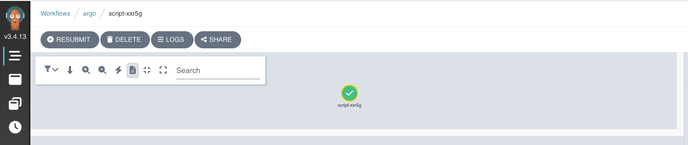
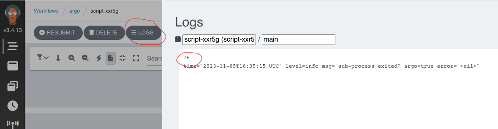
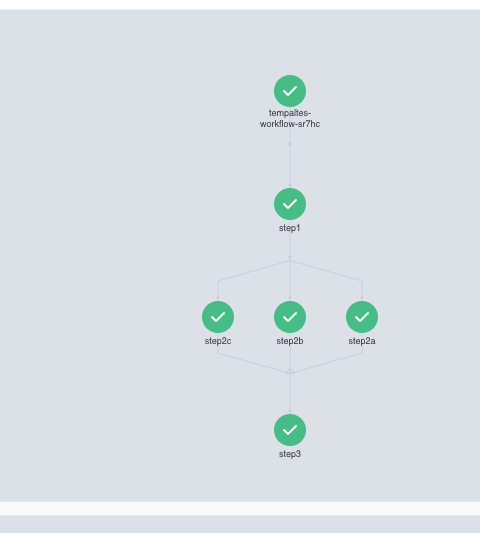
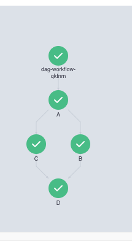

# Templates

There are 6 types of templates, divided into two different categories.
All of them are documented here :
- https://argoproj.github.io/argo-workflows/workflow-concepts/#template-types

## Template Definitions

### Container template

The most used one, you can check the example :
- container.yaml

```yaml
  - name: whalesay            
    container:
      image: busybox
      command: [echo]
      args: ["hello world"]
```

```shell
argo submit --watch container.yaml
```

### Script template
Used to define a script. you can check the example :
- container.yaml

```yaml
  - name: gen-random-int
    script:
      image: python:alpine3.6
      command: [python]
      source: |
        import random
        i = random.randint(1, 100)
        print(i)
```

```shell
argo submit --watch script.yaml
```

```shell
argo logs @latest
```

```log
script-xxr5g: 76
script-xxr5g: time="2023-11-05T18:35:15.283Z" level=info msg="sub-process exited" argo=true error="<nil>"
```

By the way, you can find the same log on the UI :
> Go to the executed workflow and click on the unique step


> Click on logs button


### Resource template

Performs operations on cluster Resources directly. It can be used to get, create, apply, delete, replace, or patch resources on your cluster.

```yaml
  - name: k8s-owner-reference
    resource:
      action: create
      manifest: |
        apiVersion: v1
        kind: ConfigMap
        metadata:
          generateName: owned-eg-
        data:
          some: value
```

### Suspend template

A suspend template will suspend execution, either for a duration or until it is resumed manually. Suspend templates can be resumed from the CLI (with argo resume), the API endpoint, or the UI.

```yaml
  - name: delay
    suspend:
      duration: "20s"
```

## Template Invocators

### Steps

A steps template allows you to define your tasks in a series of steps. The structure of the template is a "list of lists". Outer lists will run sequentially and inner lists will run in parallel.

Here's an example of one sequential step and two steps to be run in parallel :

```yaml
  - name: hello-hello-hello
    steps:
    - - name: step1
        template: prepare-data
    - - name: step2a
        template: run-data-first-half
      - name: step2b
        template: run-data-second-half
```

Like you see, with steps you cannot use a container directly for example, but you have to declare your templates and reuse them.
Here's our example :

```yaml
  - name: hello-steps
    steps:
    - - name: step1
        template: container
    - - name: step2a
        template: gen-random-int
      - name: step2b
        template: gen-random-int
      - name: step2c
        template: gen-random-int
    - - name: step3
        template: container

# Here's the templates declaration
  - name: container            
    container:
      image: busybox
      command: [echo]
      args: ["hello world"]
  - name: gen-random-int
    script:
      image: python:alpine3.6
      command: [python]
      source: |
        import random
        i = random.randint(1, 100)
        print(i)   
```
```shell
argo submit --watch templates.yaml
```

```log
STEP                         TEMPLATE        PODNAME                                            DURATION  MESSAGE
 ● tempaltes-workflow-sr7hc  hello-steps
 ├───✔ step1                 container       tempaltes-workflow-sr7hc-container-975523799       6s
 └─┬─◷ step2a                gen-random-int  tempaltes-workflow-sr7hc-gen-random-int-545476402  10s
   ├─◷ step2b                gen-random-int  tempaltes-workflow-sr7hc-gen-random-int-528698783  10s
   └─◷ step2c                gen-random-int  tempaltes-workflow-sr7hc-gen-random-int-511921164  10s

STEP                         TEMPLATE        PODNAME                                            DURATION  MESSAGE
 ● tempaltes-workflow-sr7hc  hello-steps
 ├───✔ step1                 container       tempaltes-workflow-sr7hc-container-975523799       6s
 ├─┬─✔ step2a                gen-random-int  tempaltes-workflow-sr7hc-gen-random-int-545476402  3s
 │ ├─✔ step2b                gen-random-int  tempaltes-workflow-sr7hc-gen-random-int-528698783  4s
 │ └─✔ step2c                gen-random-int  tempaltes-workflow-sr7hc-gen-random-int-511921164  4s
 └───◷ step3                 container       tempaltes-workflow-sr7hc-container-2715985839      0s

 STEP                         TEMPLATE        PODNAME                                            DURATION  MESSAGE
 ✔ tempaltes-workflow-sr7hc  hello-steps
 ├───✔ step1                 container       tempaltes-workflow-sr7hc-container-975523799       6s
 ├─┬─✔ step2a                gen-random-int  tempaltes-workflow-sr7hc-gen-random-int-545476402  3s
 │ ├─✔ step2b                gen-random-int  tempaltes-workflow-sr7hc-gen-random-int-528698783  4s
 │ └─✔ step2c                gen-random-int  tempaltes-workflow-sr7hc-gen-random-int-511921164  4s
 └───✔ step3                 container       tempaltes-workflow-sr7hc-container-2715985839      6s
```

```shell
argo logs @latest
```

```log
tempaltes-workflow-sr7hc-container-975523799: hello world
tempaltes-workflow-sr7hc-container-975523799: time="2023-11-05T19:10:32.997Z" level=info msg="sub-process exited" argo=true error="<nil>"
tempaltes-workflow-sr7hc-gen-random-int-545476402: 19
tempaltes-workflow-sr7hc-gen-random-int-545476402: time="2023-11-05T19:10:39.666Z" level=info msg="sub-process exited" argo=true error="<nil>"
tempaltes-workflow-sr7hc-gen-random-int-511921164: 53
tempaltes-workflow-sr7hc-gen-random-int-528698783: 8
tempaltes-workflow-sr7hc-gen-random-int-511921164: time="2023-11-05T19:10:40.726Z" level=info msg="sub-process exited" argo=true error="<nil>"
tempaltes-workflow-sr7hc-gen-random-int-528698783: time="2023-11-05T19:10:40.730Z" level=info msg="sub-process exited" argo=true error="<nil>"
tempaltes-workflow-sr7hc-container-2715985839: hello world
tempaltes-workflow-sr7hc-container-2715985839: time="2023-11-05T19:10:52.895Z" level=info msg="sub-process exited" argo=true error="<nil>"
```

Logs of all the steps has been displayed.

Let's check the UI :
> Go to the executed workflow and click on the unique step


Beautiful !!!!

If you need to use when clauses to run your steps, you can check this example : 
- https://raw.githubusercontent.com/argoproj/argo-workflows/master/examples/coinflip.yaml

### DAG

As an alternative to specifying sequences of steps, you can define a workflow as a directed-acyclic graph (DAG) by specifying the dependencies of each task. DAGs can be simpler to maintain for complex workflows and allow for maximum parallelism when running tasks.

In a DAG, you list all your tasks and set which other tasks must complete before a particular task can begin. Tasks without any dependencies will be run immediately.

In this example A runs first. Once it is completed, B and C will run in parallel and once they both complete, D will run:

This is handy, because you can the order of appearing of tasks is not important. You can declare the task A if you want, this will change nothing.

```yaml
  - name: diamond
    dag:
      tasks:
      - name: A
        template: echo
      - name: B
        dependencies: [A]
        template: echo
      - name: C
        dependencies: [A]
        template: echo
      - name: D
        dependencies: [B, C]
        template: echo
```

```shell
argo submit --watch dag.yaml
```

```log
STEP                   TEMPLATE   PODNAME                                  DURATION  MESSAGE
 ● dag-workflow-qktnm  diamond
 ├─✔ A                 container  dag-workflow-qktnm-container-2388676790  5s
 ├─◷ B                 container  dag-workflow-qktnm-container-2371899171  10s
 └─◷ C                 container  dag-workflow-qktnm-container-2355121552  10s

STEP                   TEMPLATE   PODNAME                                  DURATION  MESSAGE
 ● dag-workflow-qktnm  diamond
 ├─✔ A                 container  dag-workflow-qktnm-container-2388676790  5s
 ├─✔ B                 container  dag-workflow-qktnm-container-2371899171  5s
 ├─✔ C                 container  dag-workflow-qktnm-container-2355121552  8s
 └─◷ D                 container  dag-workflow-qktnm-container-2472564885  0s

STEP                   TEMPLATE   PODNAME                                  DURATION  MESSAGE
 ✔ dag-workflow-qktnm  diamond
 ├─✔ A                 container  dag-workflow-qktnm-container-2388676790  5s
 ├─✔ B                 container  dag-workflow-qktnm-container-2371899171  5s
 ├─✔ C                 container  dag-workflow-qktnm-container-2355121552  8s
 └─✔ D                 container  dag-workflow-qktnm-container-2472564885  6s
```

```shell
argo logs @latest
```

```log
dag-workflow-qktnm-container-2388676790: hello world
dag-workflow-qktnm-container-2388676790: time="2023-11-05T19:21:37.531Z" level=info msg="sub-process exited" argo=true error="<nil>"
dag-workflow-qktnm-container-2371899171: hello world
dag-workflow-qktnm-container-2371899171: time="2023-11-05T19:21:47.748Z" level=info msg="sub-process exited" argo=true error="<nil>"
dag-workflow-qktnm-container-2355121552: hello world
dag-workflow-qktnm-container-2355121552: time="2023-11-05T19:21:50.347Z" level=info msg="sub-process exited" argo=true error="<nil>"
dag-workflow-qktnm-container-2472564885: hello world
dag-workflow-qktnm-container-2472564885: time="2023-11-05T19:21:57.675Z" level=info msg="sub-process exited" argo=true error="<nil>"
```

Well, in the logs we cannot differentiate the container A from B. In the parameters lecture, we will see a feature that can customize your tasks.

Let's check the UI :
> Go to the executed workflow and click on the unique step


## References
- https://argoproj.github.io/argo-workflows/workflow-concepts/#template-types