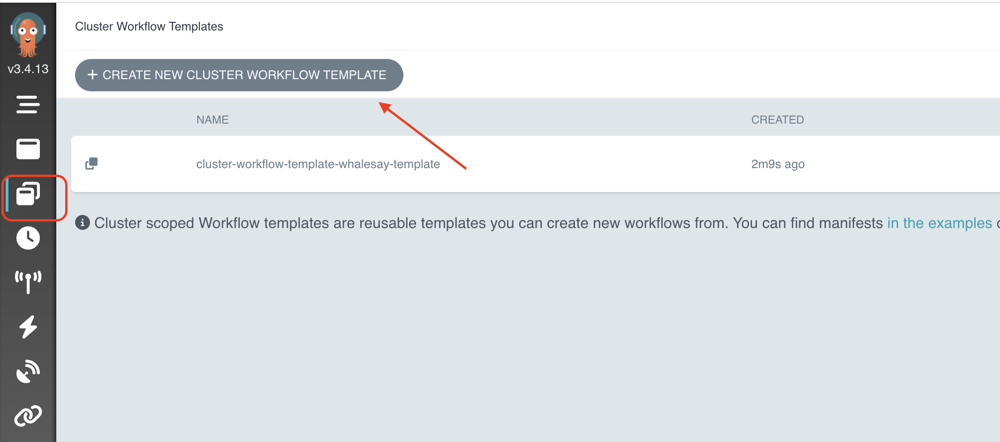

# Cluster Workflow Templates Examples

ClusterWorkflowTemplates are cluster scoped WorkflowTemplates. ClusterWorkflowTemplate can be created cluster scoped like ClusterRole and can be accessed across all namespaces in the cluster.


Here's the cluster workflow template :

```yaml
apiVersion: argoproj.io/v1alpha1
kind: ClusterWorkflowTemplate
metadata:
  name: cluster-workflow-template-whalesay-template
spec:
  templates:
  - name: whalesay-template
    inputs:
      parameters:
      - name: message
    container:
      image: busybox
      command: [echo]
      args: ["{{inputs.parameters.message}}"]
```

And here's the workflow :

```yaml
apiVersion: argoproj.io/v1alpha1
kind: Workflow
metadata:
  generateName: workflow-template-hello-world-
spec:
  entrypoint: whalesay
  templates:
  - name: whalesay
    steps:                              # You should only reference external "templates" in a "steps" or "dag" "template".
      - - name: call-whalesay-template
          templateRef:                  # You can reference a "template" from another "WorkflowTemplate or ClusterWorkflowTemplate" using this field
            name: cluster-workflow-template-whalesay-template   # This is the name of the "WorkflowTemplate or ClusterWorkflowTemplate" CRD that contains the "template" you want
            template: whalesay-template # This is the name of the "template" you want to reference
            clusterScope: true          # This field indicates this templateRef is pointing ClusterWorkflowTemplate
          arguments:                    # You can pass in arguments as normal
            parameters:
            - name: message
              value: "hello world"
```

Let's create the template :

```shell
argo cluster-template create cluster-wf-template.yaml
```

```log
Name:                cluster-workflow-template-whalesay-template
Created:             Mon Nov 06 20:54:36 +0100 (now)
```

```shell
argo submit --watch hello-world-wf.yaml
```

```log
Name:                workflow-template-hello-world-4tbn6
Namespace:           argo
ServiceAccount:      unset (will run with the default ServiceAccount)
Status:              Succeeded
Conditions:
 PodRunning          False
 Completed           True
Created:             Mon Nov 06 20:55:03 +0100 (10 seconds ago)
Started:             Mon Nov 06 20:55:03 +0100 (10 seconds ago)
Finished:            Mon Nov 06 20:55:13 +0100 (now)
Duration:            10 seconds
Progress:            1/1
ResourcesDuration:   5s*(1 cpu),5s*(100Mi memory)

STEP                                    TEMPLATE                                                       PODNAME                                                           DURATION  MESSAGE
 ✔ workflow-template-hello-world-4tbn6  whalesay
 └───✔ call-whalesay-template           cluster-workflow-template-whalesay-template/whalesay-template  workflow-template-hello-world-4tbn6-whalesay-template-3996327902  6s
```

```shell
argo logs @latest
```

```log
workflow-template-hello-world-4tbn6-whalesay-template-3996327902: hello world
workflow-template-hello-world-4tbn6-whalesay-template-3996327902: time="2023-11-06T19:55:08.481Z" level=info msg="sub-process exited" argo=true error="<nil>"
```

You can use the UI to find your cluster workflow templates :
- https://localhost:2746/workflow-templates/argo



As you can see, with the UI you can submit new cluster workflow templates.

You can also check the cluster workflow templates definition using the UI :
- 

## References
- https://argoproj.github.io/argo-workflows/cluster-workflow-templates/
