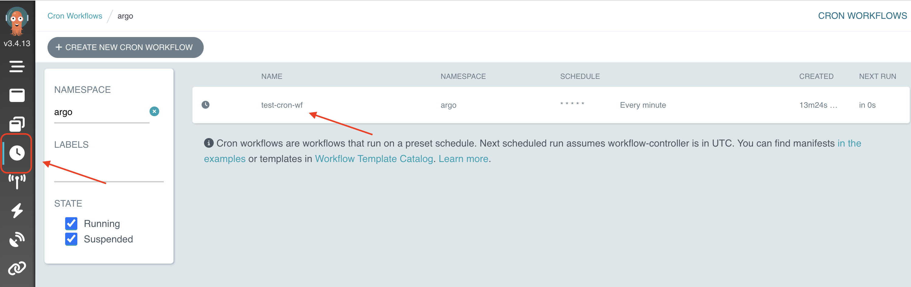
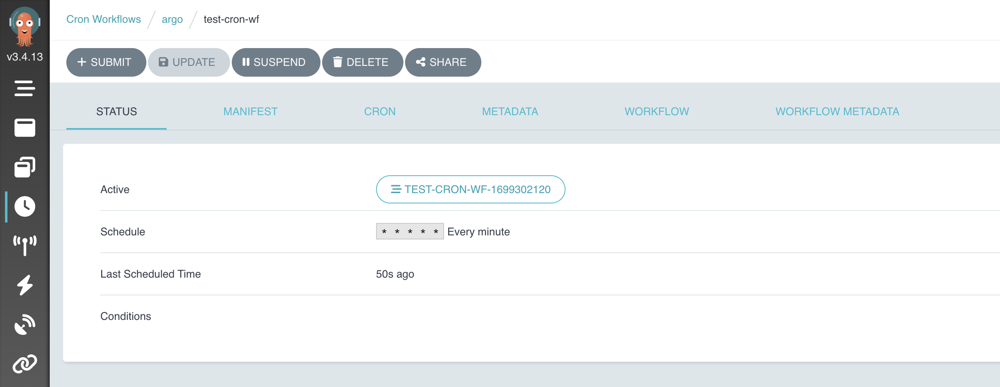
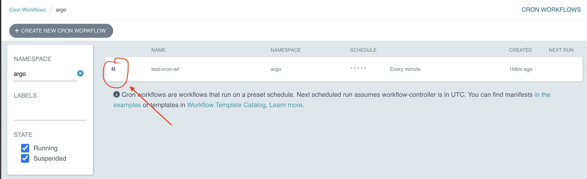
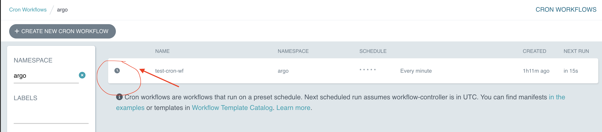

# Cron Workflows Examples

CronWorkflow are workflows that run on a preset schedule. They are designed to be converted from Workflow easily and to mimic the same options as Kubernetes CronJob. In essence, CronWorkflow = Workflow + some specific cron options.

## Workflow

And here's the workflow :

```yaml
apiVersion: argoproj.io/v1alpha1
kind: CronWorkflow
metadata:
  name: test-cron-wf
spec:
  schedule: "* * * * *"
  concurrencyPolicy: "Replace"
  startingDeadlineSeconds: 0
  workflowSpec:
    entrypoint: whalesay
    templates:
    - name: whalesay
      container:
        image: alpine:3.6
        command: [sh, -c]
        args: ["date; sleep 90"]
```

For the cron options, you can check the documentation: 
- https://argoproj.github.io/argo-workflows/cron-workflows/#cronworkflow-options

Let's create the cron workflow :

```shell
argo cron create cron.yaml
```

```log
Name:                          test-cron-wf
Namespace:                     argo
Created:                       Mon Nov 06 21:08:36 +0100 (now)
Schedule:                      * * * * *
Suspended:                     false
StartingDeadlineSeconds:       0
ConcurrencyPolicy:             Replace
NextScheduledTime:             Mon Nov 06 21:09:00 +0100 (23 seconds from now) (assumes workflow-controller is in UTC)
```

You can also use kubectl to create cron workflows.

Let's check all the crons we have :

```shell
argo cron list
```

```log
NAME           AGE   LAST RUN   NEXT RUN   SCHEDULE    TIMEZONE   SUSPENDED
test-cron-wf   31s   7s         52s        * * * * *              false
```

As you can see, our cron will be triggered each 1 minute.

Let's get all the running crons :

```shell
argo cron get test-cron-wf
```

```log
Name:                          test-cron-wf
Namespace:                     argo
Created:                       Mon Nov 06 21:08:36 +0100 (3 minutes ago)
Schedule:                      * * * * *
Suspended:                     false
StartingDeadlineSeconds:       0
ConcurrencyPolicy:             Replace
LastScheduledTime:             Mon Nov 06 21:12:00 +0100 (12 seconds ago)
NextScheduledTime:             Mon Nov 06 21:13:00 +0100 (47 seconds from now) (assumes workflow-controller is in UTC)
Active Workflows:              test-cron-wf-1699301460, test-cron-wf-1699301520
```

As you can see, crons may overlapped (because of the shedule and the sleep that we've defined).

Crons are workflows, so you can get the logs :

```shell
argo logs @latest
```

```log
test-cron-wf-1699301640: Mon Nov  6 20:14:01 UTC 2023
```

You can use the UI to find your cron workflows :
- https://localhost:2746/cron-workflows/argo



As you can see, with the UI you can submit new cron workflows.

You can also check the cron workflow details using the UI :
- 

## Commands

Let's suspend the execution :

```shell
argo cron suspend test-cron-wf
```

```log
CronWorkflow 'test-cron-wf' suspended
```

```shell
argo cron list
```

```log
NAME           AGE   LAST RUN   NEXT RUN   SCHEDULE    TIMEZONE   SUSPENDED
test-cron-wf   1h    44m        49s        * * * * *              true
```

- 

Now, let's resume :

```shell
argo cron resume test-cron-wf
```

```log
CronWorkflow 'test-cron-wf' resumed
```

```shell
argo cron list
```

```log
NAME           AGE   LAST RUN   NEXT RUN   SCHEDULE    TIMEZONE   SUSPENDED
test-cron-wf   1h    42m        15s        * * * * *              false
```

- 

Let's delete it now :

```shell
argo cron delete test-cron-wf
```

```shell
argo cron list
```

```log
NAME   AGE   LAST RUN   NEXT RUN   SCHEDULE   TIMEZONE   SUSPENDED
```

You can find more commands here :
- https://argoproj.github.io/argo-workflows/cli/argo_cron/

## Kubectl

For crons, you can use kubectl to run your files :

```shell
kubectl apply cron.yaml
```

```log
cronworkflow.argoproj.io/test-cron-wf created
```

Let's get the objects :

```shell
kubectl get cwf
```

```log
NAME           AGE
test-cron-wf   43m
```

```shell
argo cron list
```

```log
NAME           AGE   LAST RUN   NEXT RUN   SCHEDULE    TIMEZONE   SUSPENDED
test-cron-wf   44m   42m        20s        * * * * *              false
```

As you can see, our cron will be triggered each 1 minute.

Let's get all the running crons :

```shell
argo cron get test-cron-wf
```

```log
Name:                          test-cron-wf
Namespace:                     argo
Created:                       Mon Nov 06 21:44:35 +0100 (44 minutes ago)
Schedule:                      * * * * *
Suspended:                     false
StartingDeadlineSeconds:       0
ConcurrencyPolicy:             Replace
LastScheduledTime:             Mon Nov 06 22:29:00 +0100 (8 seconds ago)
NextScheduledTime:             Mon Nov 06 22:30:00 +0100 (51 seconds from now) (assumes workflow-controller is in UTC)
Active Workflows:              test-cron-wf-1699303560, test-cron-wf-1699306140
```


## References
- https://argoproj.github.io/argo-workflows/cron-workflows/
- https://en.wikipedia.org/wiki/Cron
- https://argoproj.github.io/argo-workflows/cli/argo_cron_suspend/