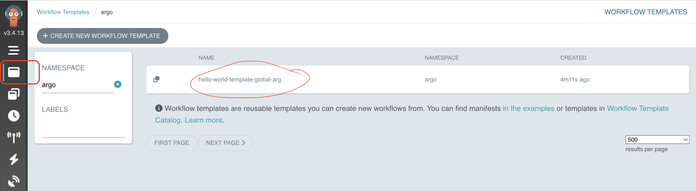
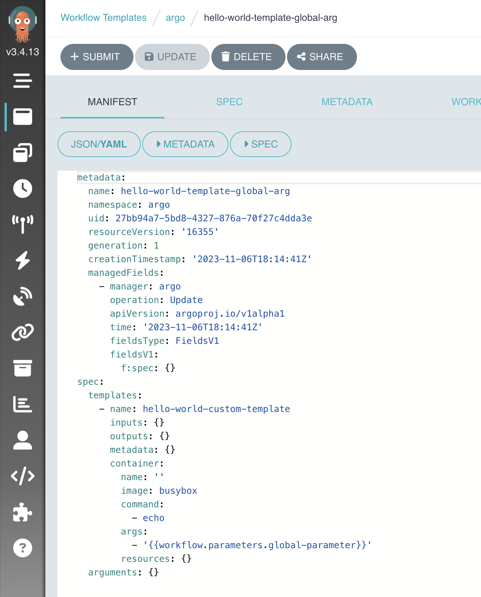

# Workflow Tempaltes Examples

WorkflowTemplates are definitions of Workflows that live in your cluster. This allows you to create a library of frequently-used templates and reuse them by referencing them from your Workflows.

Here's the workflow template :

```yaml
apiVersion: argoproj.io/v1alpha1
kind: WorkflowTemplate
metadata:
  name: hello-world-template-global-arg
spec:
  templates:
    - name: hello-world-custom-template
      container:
        image: busybox
        command: [echo]
        args: ["{{workflow.parameters.global-parameter}}"]
```

And here's the workflow :

```yaml
apiVersion: argoproj.io/v1alpha1
kind: Workflow
metadata:
  generateName: hello-world-wf-global-arg-
spec:
  entrypoint: whalesay
  arguments:
    parameters:
      - name: global-parameter
        value: hello wor- from workflow templates -ld
  templates:
    - name: whalesay
      steps:
        - - name: hello-world
            templateRef:
              name: hello-world-template-global-arg
              template: hello-world-custom-template
```

Let's create the template :

```shell
argo template create hello-world-wt.yaml
```

```log
Name:                hello-world-template-global-arg
Namespace:           argo
Created:             Mon Nov 06 19:14:41 +0100 (now)
```

```shell
argo submit --watch hello-world-w.yaml
```

```log
SName:                hello-world-wf-global-arg-d722q
Namespace:           argo
ServiceAccount:      unset (will run with the default ServiceAccount)
Status:              Succeeded
Conditions:
 PodRunning          False
 Completed           True
Created:             Mon Nov 06 19:15:42 +0100 (10 seconds ago)
Started:             Mon Nov 06 19:15:42 +0100 (10 seconds ago)
Finished:            Mon Nov 06 19:15:52 +0100 (now)
Duration:            10 seconds
Progress:            1/1
ResourcesDuration:   5s*(1 cpu),5s*(100Mi memory)
Parameters:
  global-parameter:  hello wor- from workflow templates -ld

STEP                                TEMPLATE                                                     PODNAME                                                                 DURATION  MESSAGE
 ✔ hello-world-wf-global-arg-d722q  whalesay
 └───✔ hello-world                  hello-world-template-global-arg/hello-world-custom-template  hello-world-wf-global-arg-d722q-hello-world-custom-template-3508050641  5s
```

```shell
argo logs @latest
```

```log
hello-world-wf-global-arg-d722q-hello-world-custom-template-3508050641: hello wor- from workflow templates -ld
hello-world-wf-global-arg-d722q-hello-world-custom-template-3508050641: time="2023-11-06T18:15:46.925Z" level=info msg="sub-process exited" argo=true error="<nil>"
```

You can use the UI to find your workflow templates :
- https://localhost:2746/workflow-templates/argo



As you can see, with the UI you can submit new workflow templates.

You can also check the workflow templates definition using the UI :
- 

## References
- https://argoproj.github.io/argo-workflows/workflow-templates/